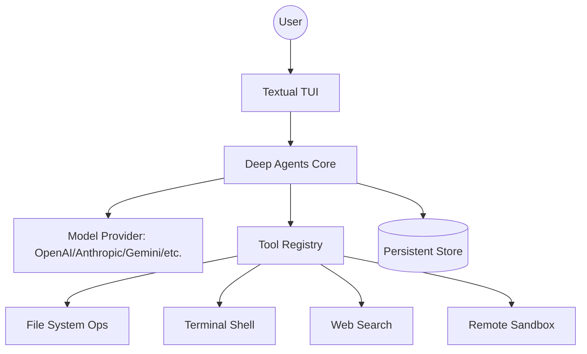

<p align="center">
  
</p>

# 🧠🤖 Deep Agents Code

The fastest way to start using Deep Agents. `deepagents-code` is a pre-built coding agent in your terminal — similar to Claude Code or Cursor — powered by any LLM that supports tool calling.

[](https://pypi.org/project/deepagents-code/#history)
[](https://opensource.org/licenses/MIT)
[](https://pypistats.org/packages/deepagents-code)
[](https://x.com/langchain_oss)

---

## 🚀 Quick Start

Get up and running in seconds with a single command:

```bash
curl -LsSf https://langch.in/dcode | bash
```

**With model provider extras** (e.g., Nvidia, Ollama):
```bash
DEEPAGENTS_CODE_EXTRAS="nvidia,ollama" curl -LsSf https://langch.in/dcode | bash
```

**Launch the agent:**
```bash
dcode
```

---

## 💡 Why this project exists

Writing AI agents from scratch is tedious. `deepagents-code` provides a production-ready, interactive terminal environment that brings the power of LLM-driven coding (file manipulation, shell execution, and autonomous reasoning) directly to your CLI without requiring you to write a single line of orchestration code.

---

## ✨ Features

| Category | Capability | Status |
| :--- | :--- | :--- |
| **Interface** | Rich TUI with streaming responses | ✅ Stable |
| **Context** | Conversation resume across sessions | ✅ Stable |
| **Intelligence** | Live web search grounding | ✅ Stable |
| **Isolation** | Remote sandboxes (Modal, Daytona, Runloop, etc.) | ✅ Stable |
| **Memory** | Persistent context across conversations | ✅ Stable |
| **Extensibility** | Custom skills via slash commands | ✅ Stable |
| **Automation** | Headless mode for scripting and CI | ✅ Stable |
| **Control** | Human-in-the-loop approval gates | ✅ Stable |

---

## 🏗️ Architecture



---

## 📁 Project Structure

```text
libs/code/
├── deepagents_code/    # Core logic and TUI implementation
│   ├── built_in_skills/ # Default agent capabilities
│   ├── integrations/   # Sandbox and Model provider logic
│   ├── mcp_providers/   # Model Context Protocol implementations
│   └── widgets/        # Textual UI components
├── examples/            # Example custom skills
├── scripts/            # Maintenance and installation scripts
├── tests/              # Unit and integration test suites
└── pyproject.toml      # Build system and dependency config
```

---

## 🛠️ Common Commands

| Command | Description |
| :--- | :--- |
| `dcode` | Start the interactive coding agent session |
| `deepagents-code` | Alternative entry point for the CLI |
| `pip install deepagents-code` | Standard Python package installation |

---

## ⚠️ Current Limitations

> [!WARNING]
> **Security Risk:** By default, `dcode` trusts the directory it is run in. Project artifacts are read *before* approval prompts. **Never run `dcode` in an untrusted directory without using a remote sandbox backend.**

---

## 🗺️ Documentation Map

- **[Full Documentation](https://docs.langchain.com/deepagents-code)** - Comprehensive guides and API refs.
- **[Changelog](https://github.com/langchain-ai/deepagents/blob/main/libs/code/CHANGELOG.md)** - Track latest updates and fixes.
- **[Threat Model](https://github.com/langchain-ai/deepagents/blob/main/libs/code/THREAT_MODEL.md)** - Deep dive into the security architecture.
- **[Deep Agents SDK](https://github.com/langchain-ai/deepagents)** - The underlying harness powering the CLI.

---

## 🤝 Contributing

We welcome contributions! To contribute:

1. **Fork** the repository.
2. **Create a branch** for your feature or fix.
3. **Implement** changes and ensure all tests in `tests/` pass.
4. **Submit a PR** with a clear description of the changes.

For detailed guidelines, see the [Contributing Guide](https://docs.langchain.com/oss/python/contributing/overview).

---

## 📄 License

SPDX License Identifier: MIT
Copyright (c) 2026 LangChain AI
