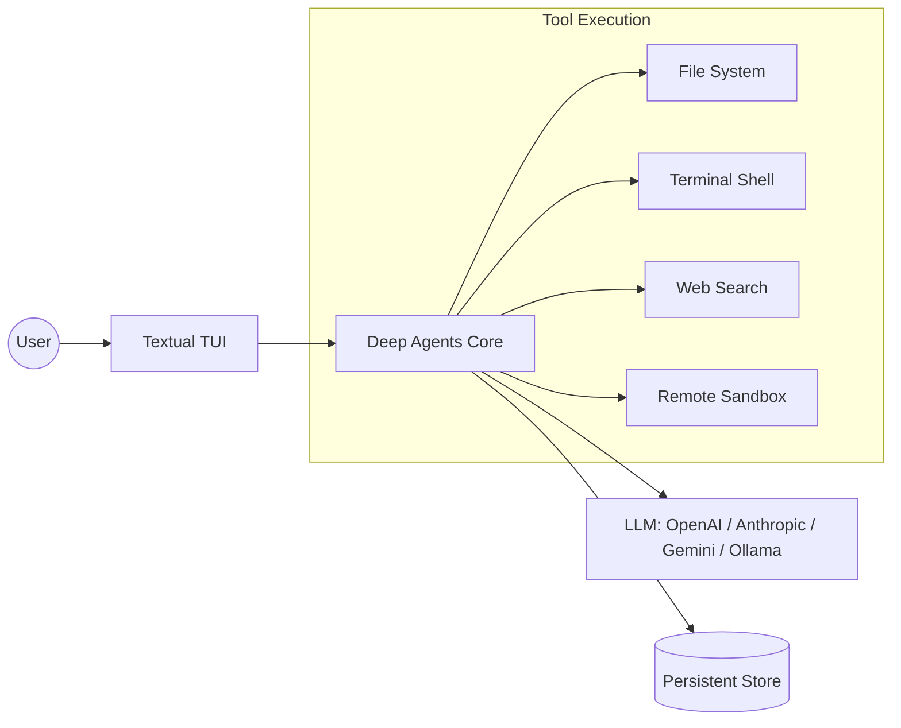

<p align="center">
  
</p>

# 🧠🤖 Deep Agents Code

**The fastest way to start using Deep Agents. `deepagents-code` is a production-ready terminal AI agent—similar to Claude Code or Cursor—powered by any tool-calling LLM.**

[](https://pypi.org/project/deepagents-code/#history)
[](https://opensource.org/licenses/MIT)
[](https://pypistats.org/packages/deepagents-code)
[](https://x.com/langchain_oss)

---

## 🚀 Quick Start

Get a state-of-the-art coding agent in your terminal in < 10 seconds:

```bash
curl -LsSf https://langch.in/dcode | bash
```

> [!TIP]
> **Power User Setup:** Want Nvidia or Ollama support? Run with extras:
> ```bash
> DEEPAGENTS_CODE_EXTRAS="nvidia,ollama" curl -LsSf https://langch.in/dcode | bash
> ```

**Launch it:**
```bash
dcode
```

---

## 💡 The Value Proposition

Why use `deepagents-code` instead of writing your own agent?

1. **Zero Orchestration**: Skip the boilerplate. Get a full-featured TUI, session management, and tool registry out of the box.
2. **True Autonomy**: Not just a chatbot. It can read/write files, execute shell commands, and spawn sub-agents to solve complex problems.
3. **Environmental Isolation**: Seamlessly switch between your local machine and remote sandboxes (Modal, Daytona, etc.) to keep your host safe.

---

## ✨ Core Capabilities

| Feature | Capability | Status |
| :--- | :--- | :--- |
| **TUI Experience** | Rich, streaming terminal interface with an intuitive UX | ✅ Stable |
| **State Persistence** | Resume complex conversations across different sessions | ✅ Stable |
| **Live Grounding** | Integrated web search to avoid model hallucinations | ✅ Stable |
| **Safe Execution** | Remote sandbox integration for untrusted code execution | ✅ Stable |
| **Long-term Memory** | Persistent context that evolves across conversations | ✅ Stable |
| **Custom Skills** | Extend agent behavior via slash commands (Skills) | ✅ Stable |
| **CI/CD Ready** | Headless mode for automated scripting and pipeline tasks | ✅ Stable |
| **Human-in-the-Loop** | Fine-grained approval gates for all destructive tool calls | ✅ Stable |

---

## 🏗️ Architecture & Data Flow



---

## 📁 Project Structure

```text
libs/code/
├── deepagents_code/    # 📦 Core Engine & UI
│   ├── built_in_skills/ # 🛠️ Default capabilities (remember, skill-creator)
│   ├── integrations/   # 🔌 Sandbox & Model provider logic
│   ├── mcp_providers/   # 🌐 Model Context Protocol implementations
│   └── widgets/        # 🎨 Textual UI components
├── examples/            # 📖 Example custom skills (arxiv, web-research)
├── scripts/            # ⚙️ Installation & maintenance tools
├── tests/              # 🧪 Unit & Integration test suites
└── pyproject.toml      # 🛠️ Build & Dependency configuration
```

---

## 🛠️ Quick Reference

| Command | Action |
| :--- | :--- |
| `dcode` | Launch the interactive agent |
| `deepagents-code` | Alternative CLI entry point |
| `pip install deepagents-code` | Standard installation |

---

## ⚠️ Security First

> [!WARNING]
> **Implicit Trust:** By default, `dcode` trusts the current working directory. It reads project artifacts *before* asking for approval. 
> **The Golden Rule:** Never run `dcode` in an untrusted repository without a **remote sandbox backend**.

---

## 🗺️ Ecosystem Map

- **[Full Documentation](https://docs.langchain.com/deepagents-code)** $\rightarrow$ Deep dives and API references.
- **[Changelog](https://github.com/langchain-ai/deepagents/blob/main/libs/code/CHANGELOG.md)** $\rightarrow$ Latest releases and hotfixes.
- **[Threat Model](https://github.com/langchain-ai/deepagents/blob/main/libs/code/THREAT_MODEL.md)** $\rightarrow$ Understanding the security boundaries.
- **[Deep Agents SDK](https://github.com/langchain-ai/deepagents)** $\rightarrow$ The underlying framework powering the CLI.

---

## 🤝 Contributing

We are building the future of agentic coding. Join us:

1. **Fork** the repo $\rightarrow$ **Create a branch** $\rightarrow$ **Implement** $\rightarrow$ **Test** $\rightarrow$ **PR**.
2. Ensure all tests in `tests/` pass before submitting.
3. Check the [Contributing Guide](https://docs.langchain.com/oss/python/contributing/overview) for specific quality gates.

---

## 📄 License

**SPDX License Identifier: MIT**
Copyright (c) 2026 LangChain AI
